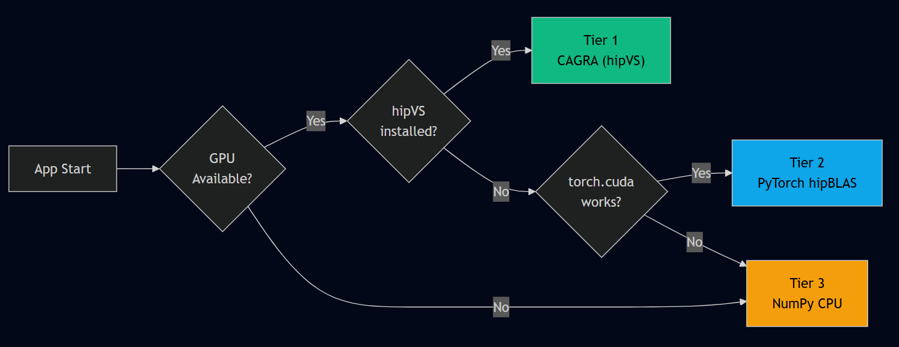

<div align="center">

# ROCKIT Vision Intelligence

### GPU-Accelerated Multimodal Search Engine

*Build isolated projects, ingest images and videos, search with natural language — all powered by AMD hipVS CAGRA graph indexes with NVMe-backed hot-swap memory management.*

[](https://huggingface.co/spaces)
[](LICENSE)
[](https://www.python.org/)

</div>

---

## What Is This?

ROCKIT Vision Intelligence is an **open-source, self-hosted multimodal search engine** that lets you create isolated projects, ingest visual media (images, videos), and query them with natural language. It is built for the **AMD Hackathon** and designed to showcase GPU-accelerated approximate nearest-neighbor (ANN) search using the **hipVS CAGRA** graph index on AMD ROCm hardware.

The core idea is simple:

> **Upload media → Embed everything into a shared vector space → Build a CAGRA graph on the GPU → Search in microseconds → Let an LLM interpret the results.**

There is no database. There are no external API dependencies. Every embedding, every index, and every LLM inference can run **entirely on local hardware** — from a single AMD GPU to a CPU-only Hugging Face free tier.

---

## Key Features

### Multi-Project Isolation
Create **multiple projects**, each with its own sources, indexes, and configuration. Projects are fully isolated — ingesting media into one never affects another.

```
projects/
  ├── security-cam/           # CCTV footage analysis
  │   ├── sources/
  │   ├── indexes/
  │   └── config.json
  ├── product-catalog/        # E-commerce image search
  │   ├── sources/
  │   ├── indexes/
  │   └── config.json
  └── nature-docs/            # Wildlife video intelligence
      ├── sources/
      ├── indexes/
      └── config.json
```

### Native Multimodal Embedding (No Captioning)
Unlike caption-then-embed pipelines, ROCKIT uses **true vision-language embedding models** that encode images, video frames, and text queries into the **same vector space** directly. No intermediate captioning step — no information loss.

| Tier | Model | Dim | Use Case |
|------|-------|-----|----------|
| GPU (large) | `Qwen/Qwen3-VL-Embedding-8B` | 4096 | Highest quality, production |
| GPU (small) | `Qwen/Qwen3-VL-Embedding-2B` | 2048 | Balanced speed / quality |
| CPU fallback | `openai/clip-vit-large-patch14` | 768 | Free-tier HF Spaces, dev |

### CAGRA Graph Index (hipVS)
The CAGRA graph index is the fastest known ANN algorithm for GPU-resident data. ROCKIT rebuilds the CAGRA graph on every insert because this project is **optimized for inference and query speed**, not ingestion throughput. A 100K-vector CAGRA rebuild takes ~2 seconds on an MI250X — negligible compared to the embedding cost.

### NVMe → VRAM Async Hot-Swap
Indexes live in three tiers of memory. When a project is queried, its index is **asynchronously copied from NVMe into VRAM** via pinned-memory DMA, without blocking other projects. When VRAM fills up, least-recently-used indexes are evicted back to NVMe — not deleted.

```
┌──────────────┐    async copy     ┌──────────────┐     evict      ┌──────────────┐
│   NVMe SSD   │ ──────────────→  │  GPU VRAM    │ ──────────────→ │   NVMe SSD   │
│  (cold store) │ ←────────────── │  (hot index)  │                │  (cold store) │
│  .cagra file  │    restore       │  CAGRA graph  │                │  .cagra file  │
└──────────────┘                  └──────────────┘                 └──────────────┘
                                        ↑
                                    search()
                                        ↑
                                  query vector
```

This design lets you run **dozens of projects** on a single GPU by keeping only the active ones hot. Full VRAM capacity is utilized.

### LLM-Interpreted Results
Raw vector search returns `(id, score)` tuples. Before showing results to the user, ROCKIT passes them through an LLM that interprets the matches, merges adjacent video timestamps into time ranges, and generates a human-readable summary.

| Tier | Model | Notes |
|------|-------|-------|
| Primary | `Qwen/Qwen3-35B-A3B` | MoE: 35B total, 3B active — fast + smart |
| Fallback | `Qwen/Qwen3-1.7B` | Tiny, runs on anything |
| API | HF Inference API | Zero local compute, free tier |

---

## Architecture


### Data Flow (Single Query)


---

## GPU Compute Tiers

ROCKIT automatically detects available hardware and selects the best backend:



| Tier | Backend | Search Latency (100K vectors) | When Used |
|------|---------|-------------------------------|-----------|
| 1 | CAGRA graph (hipVS / cuVS) | ~50 μs | AMD ROCm GPU + `hipvs` installed |
| 2 | Flat tensor (hipBLAS matmul) | ~2 ms | Any CUDA/ROCm GPU |
| 3 | NumPy cosine similarity | ~15 ms | CPU-only / free HF Space |

---

## Project Structure

```
HF_Space_hipVS/
├── app.py              # Gradio UI — 3 tabs (Search, Upload, About)
├── config.py           # Env-aware configuration, auto-scales by hardware
├── embedding.py        # Qwen3-VL / CLIP multimodal embedding + LLM calls
├── vector_store.py     # 3-tier vector store (CAGRA → GPU → CPU) + NVMe swap
├── ingest.py           # Image & video ingestion pipeline
├── search.py           # Query → embed → search → LLM interpret
├── seed_data.py        # Auto-seed from HF datasets on first launch
├── requirements.txt    # HF-native dependencies
├── README.md           # This file
├── .env.example        # Environment variable template
└── data/
    ├── projects/       # Per-project source files and indexes
    │   └── default/
    │       ├── images/
    │       ├── videos/
    │       └── indexes/
    └── models/         # Cached model weights (auto-downloaded)
```

---

## Models

### Embedding (Multimodal — Images + Text in same space)

No captioning model is used. Both images and text are embedded directly into a shared vector space by a single vision-language model.

| Model | Params | Dim | Modalities | Tier |
|-------|--------|-----|------------|------|
| `Qwen/Qwen3-VL-Embedding-8B` | 8B | 4096 | image, video frame, text | GPU (production) |
| `Qwen/Qwen3-VL-Embedding-2B` | 2B | 2048 | image, video frame, text | GPU (balanced) |
| `openai/clip-vit-large-patch14` | 428M | 768 | image, text | CPU (fallback) |

### LLM (Search Result Interpretation)

| Model | Params | Architecture | Tier |
|-------|--------|-------------|------|
| `Qwen/Qwen3-35B-A3B` | 35B (3B active) | MoE | Primary — fast inference, smart |
| `Qwen/Qwen3-1.7B` | 1.7B | Dense | Fallback — runs on anything |
| HF Inference API | -- | Serverless | API fallback — zero local compute |

---

## Setup

### Hugging Face Space (Recommended)

1. Create a new Space (Gradio SDK)
2. Push the `HF_Space_hipVS/` directory
3. Set these **Secrets** in Space Settings:

| Secret | Required | Description |
|--------|----------|-------------|
| `HF_TOKEN` | Optional | HF write token for dataset persistence + Inference API |
| `USE_GPU` | Optional | Set `true` on GPU-enabled Spaces |
| `HF_DATASET_REPO` | Optional | e.g. `username/aria-index` for persistent storage |

4. The Space auto-seeds demo content from `flickr30k` on first launch.

### Local / AMD GPU Server

```bash
cd HF_Space_hipVS
cp .env.example .env         # edit with your settings
pip install -r requirements.txt
python app.py                # starts on http://localhost:7860
```

For CAGRA acceleration on AMD:
```bash
pip install hipvs cupy-rocm   # enables Tier 1
export USE_GPU=true
python app.py
```

---

## Environment Variables

| Variable | Default | Description |
|----------|---------|-------------|
| `USE_GPU` | `false` | Enable GPU acceleration |
| `EMBED_MODEL` | auto-detected | Override embedding model |
| `EMBED_DIM` | auto-detected | Embedding dimensionality |
| `LLM_MODEL` | `Qwen/Qwen3-35B-A3B` | LLM for result summarization |
| `LLM_FALLBACK` | `Qwen/Qwen3-1.7B` | Fallback LLM |
| `FRAME_EVERY_SEC` | `5` | Video frame extraction interval |
| `HF_TOKEN` | -- | HF token for persistence + API |
| `HF_DATASET_REPO` | -- | HF Dataset repo for cold storage |
| `AUTO_SEED` | `true` | Auto-seed on first empty launch |
| `SEED_DATASET` | `nlphuji/flickr30k` | Dataset for auto-seeding |
| `SWAP_PATH` | `data/indexes` | NVMe path for index swap files |

---

## How It Works

### 1. Create a Project
Each project is an isolated workspace with its own sources, embeddings, and CAGRA index. You can have a "security-cam" project and a "product-catalog" project running on the same GPU without interference.

### 2. Ingest Media
Upload images or videos. For videos, ffmpeg extracts one representative frame every N seconds. Every image and frame is embedded directly by the vision-language model (Qwen3-VL or CLIP) — no captioning, no text intermediary.

### 3. CAGRA Build
After every insert, the CAGRA graph index is **fully rebuilt** from the updated vector set. This is intentional: ROCKIT is optimized for query speed, not ingestion throughput. A 100K rebuild takes ~2s on MI250X. The built graph is immediately serialized to NVMe.

### 4. Search
When you search, the query text is embedded by the same model. The CAGRA index is loaded into VRAM (if not already hot) via async pinned-memory DMA, and searched in microseconds. Results are post-processed: video frame hits are merged into time ranges, and the full result set is sent to the LLM for a human-friendly summary.

### 5. Memory Management
Multiple project indexes coexist by swapping between NVMe and VRAM. Active indexes are kept hot; idle ones are evicted. Restoration from NVMe is a fast deserialization — no re-embedding, no rebuild.

---

## Design Decisions

| Decision | Rationale |
|----------|-----------|
| **No captioning model** | Vision-language embedding models (Qwen3-VL, CLIP) encode images directly into the same space as text. Captioning adds latency and loses visual information. |
| **Rebuild CAGRA on every insert** | This project is inference-heavy. Query latency matters more than ingestion speed. CAGRA rebuild is fast enough (~2s for 100K vectors). |
| **NVMe swap, not eviction** | Indexes are expensive to build. Serializing to NVMe and restoring is 100x faster than re-embedding from source. |
| **Multi-project isolation** | Real-world use cases involve multiple distinct corpora. Isolation prevents cross-contamination and allows per-project model configuration. |
| **No external database** | Everything is `.npz` + `.cagra` files. Portable, debuggable, no ops overhead. HF Dataset push is optional backup. |
| **MoE LLM (Qwen3-35B-A3B)** | 35B params for quality, but only 3B active per token — inference cost of a 3B model with the reasoning of a 35B. |

---

## License

Apache 2.0

---

<div align="center">
<i>Built for the AMD Hackathon — ROCKIT Vision Intelligence Platform</i>
</div>
