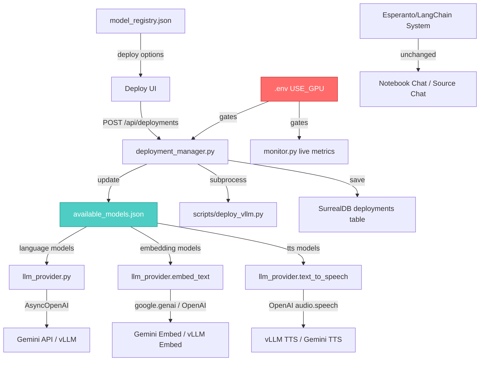

# LLM Provider Unification, Model Registry Expansion & vLLM Deployment System

## Problem Statement

The ARIA codebase has **two parallel LLM calling systems** that are not unified, the `available_models.json` only lists language models (no embedding/TTS), there is no TTS integration via OpenAI-compatible API, and the vLLM deployment system is entirely static mock data. This plan addresses all of these issues and introduces a `USE_GPU` flag to safely gate GPU-dependent code.

---

## Current State Audit

### 1. Two Parallel LLM Calling Systems

#### System A: `api/llm_provider.py` (GenUI / Standalone Chat)

| Aspect | Details |
|---|---|
| **Used by** | `genui_chat.py` router |
| **Client** | `openai.AsyncOpenAI` → Gemini's OpenAI-compatible endpoint |
| **Async?** | ✅ Fully async (`AsyncOpenAI`, `async for`) |
| **Model source** | `data/available_models.json` (only 4 Gemini language models) |
| **Embedding** | `google.genai.Client.models.embed_content()` — **sync**, hardcoded `gemini-embedding-2`, dim=2048 |
| **TTS** | ❌ None |
| **Functions** | `stream_chat_completion()`, `get_chat_completion()`, `embed_text()` |

#### System B: `open_notebook/ai/models.py` → Esperanto/LangChain (Notebook Chat, Source Chat, Transformations, Podcasts)

| Aspect | Details |
|---|---|
| **Used by** | `chat.py`, `source_chat.py`, `transformations.py`, `podcasts.py` routers via LangGraph |
| **Client** | `esperanto.AIFactory` → LangChain wrappers |
| **Async?** | ⚠️ Mixed — `ModelManager` methods are async, but `provision_langchain_model()` returns sync LangChain model, called via `asyncio.to_thread` in graphs |
| **Model source** | SurrealDB `model` table + `DefaultModels` record + env vars |
| **Embedding** | `AIFactory.create_embedding()` via `model_manager.get_embedding_model()` |
| **TTS** | `AIFactory.create_text_to_speech()` via `model_manager.get_text_to_speech()` — used by podcast commands |
| **Functions** | `get_model()`, `get_default_model()`, `get_embedding_model()`, `get_text_to_speech()`, `get_speech_to_text()` |

#### System C: Standalone Scripts (Vision Ingestion)

| Aspect | Details |
|---|---|
| **Used by** | `ingest_sample_vision.py`, `query_vision_image.py`, `query_vision_video.py` |
| **Client** | `google.genai.Client` directly |
| **Embedding** | Hardcoded `gemini-embedding-2`, dim=2048 |
| **TTS** | ❌ None |

#### System D: Podcast TTS (Direct Gemini)

| Aspect | Details |
|---|---|
| **Used by** | `commands/podcast_commands.py` |
| **Client** | `google.genai.Client` for Gemini TTS, Esperanto for other TTS |
| **TTS** | `generate_with_gemini_tts()` — uses Gemini native API, not OpenAI-compatible |

### 2. Three Functions Needed

| Function | Exists? | Location | OpenAI-Compatible? |
|---|---|---|---|
| **Text Generation** | ✅ | `llm_provider.stream_chat_completion()` | ✅ Uses `AsyncOpenAI` |
| **Text Generation** | ✅ | `provision_langchain_model()` → LangChain | ❌ Esperanto/LangChain |
| **Embeddings** | ✅ | `llm_provider.embed_text()` | ❌ Uses `google.genai` directly |
| **Embeddings** | ✅ | `model_manager.get_embedding_model()` | ❌ Esperanto |
| **TTS** | ⚠️ Partial | `podcast_commands.generate_with_gemini_tts()` | ❌ Uses native Gemini API |
| **TTS (OpenAI-compatible)** | ❌ | Not implemented | ❌ |

### 3. Model Sources

| Component | Where models come from |
|---|---|
| GenUI Chat | `data/available_models.json` (4 Gemini models only, type=language) |
| Notebook/Source Chat | SurrealDB `model` table + `DefaultModels` record |
| Vision Ingestion | Hardcoded `gemini-embedding-2` in script |
| Podcast TTS | SurrealDB `model` table (speaker profiles reference model IDs) |
| Deployments UI | `data/deployed_models.json` (static mock) + `data/model_registry.json` (deploy options) |
| Monitor | `api/routers/monitor.py` (hardcoded static data) |

---

## User Review Required

> [!IMPORTANT]
> **DB vs JSON for deployment state**: The plan uses **SurrealDB** for deployment records (since the rest of the app already uses it and the monitor/deployments UI needs live data). `deployed_models.json` becomes a cache/fallback, not the source of truth. Is this acceptable, or do you prefer a pure JSON approach?

> [!IMPORTANT]
> **vLLM deployment mechanism**: The plan assumes vLLM is launched via `subprocess` (spawning `vllm serve <model>` as a background process). For production, Docker-based deployment would be better but adds complexity. Which approach do you prefer?

> [!WARNING]
> **Esperanto system untouched**: The plan does NOT replace System B (Esperanto/LangChain). The Notebook Chat, Source Chat, and Transformation pipelines are deeply integrated with LangGraph and Esperanto. Replacing them would be a massive refactor with high risk. Instead, we add an OpenAI-compatible layer alongside it. Is this acceptable?

---

## Open Questions

> [!IMPORTANT]
> **Q1**: For the `USE_GPU=false` (your i3 PC) case, should the embedding calls still use cloud Gemini API (`gemini-embedding-2`), or should we also gate those behind the flag?

> [!IMPORTANT]
> **Q2**: The TTS example you gave uses `voice="Cherry"` — should we store available voices per TTS model in `available_models.json`, or make it a free-text parameter?

> [!IMPORTANT]
> **Q3**: For vLLM deployment, what's the target machine? Is it a remote server with AMD MI300X GPUs that you SSH into, or is vLLM expected to run on the same machine as the ARIA backend?

---

## Proposed Changes

### Component 1: Expand `available_models.json`

#### [MODIFY] [available_models.json](file:///c:/Users/venub/Desktop/Projects/AMD%20hackathon/Aria-gui/AMD-ARIA/data/available_models.json)

Add sections for **embedding** and **TTS** models alongside existing language models:

```json
[
  {
    "id": "gemini-3-flash-preview",
    "name": "Gemini 3 Flash",
    "provider": "google",
    "type": "language"
  },
  {
    "id": "gemini-2.0-flash",
    "name": "Gemini 2.0 Flash",
    "provider": "google",
    "type": "language"
  },
  {
    "id": "gemini-2.5-pro-preview-05-06",
    "name": "Gemini 2.5 Pro",
    "provider": "google",
    "type": "language"
  },
  {
    "id": "gemini-2.0-flash-lite",
    "name": "Gemini 2.0 Flash Lite",
    "provider": "google",
    "type": "language"
  },
  {
    "id": "gemini-embedding-2",
    "name": "Gemini Embedding 2",
    "provider": "google",
    "type": "embedding",
    "params": {
      "dimensions": 2048,
      "max_input_tokens": 8192
    }
  },
  {
    "id": "bge-m3",
    "name": "BGE-M3 (vLLM)",
    "provider": "vllm",
    "type": "embedding",
    "params": {
      "dimensions": 1024,
      "base_url": "http://localhost:8000/v1"
    }
  },
  {
    "id": "gemini-3.1-flash-tts-preview",
    "name": "Gemini Flash TTS",
    "provider": "google",
    "type": "tts",
    "params": {
      "voices": ["Zephyr", "Puck", "Charon", "Kore", "Fenrir", "Leda"],
      "format": "wav",
      "sample_rate": 24000
    }
  },
  {
    "id": "Qwen3-TTS-1.7B",
    "name": "Qwen3 TTS (vLLM)",
    "provider": "vllm",
    "type": "tts",
    "params": {
      "voices": ["Cherry", "Serena", "Ethan"],
      "base_url": "http://localhost:8000/v1",
      "format": "mp3"
    }
  }
]
```

---

### Component 2: Unify `api/llm_provider.py`

#### [MODIFY] [llm_provider.py](file:///c:/Users/venub/Desktop/Projects/AMD%20hackathon/Aria-gui/AMD-ARIA/api/llm_provider.py)

Add three clear functions that all read from `available_models.json`:

**Existing (keep):**
- `stream_chat_completion()` — already OpenAI-compatible ✅
- `get_chat_completion()` — already OpenAI-compatible ✅
- `embed_text()` — refactor to support both Google and vLLM providers

**New additions:**

```python
# ── Model Resolution ────────────────────────────────────────────────

def get_models_by_type(model_type: str) -> list[dict]:
    """Return models filtered by type from available_models.json."""
    return [m for m in get_available_models() if m["type"] == model_type]

def get_default_embedding_model() -> dict | None:
    """Return the first embedding model from available_models.json."""
    models = get_models_by_type("embedding")
    return models[0] if models else None

def get_default_tts_model() -> dict | None:
    """Return the first TTS model from available_models.json."""
    models = get_models_by_type("tts")
    return models[0] if models else None


# ── Embedding (multi-provider) ──────────────────────────────────────

def embed_text(
    text: str,
    model: str | None = None,
    output_dimensionality: int | None = None,
) -> list[float]:
    """
    Embed text using the specified or default embedding model.
    Supports both Google Gemini and OpenAI-compatible (vLLM) endpoints.
    """
    model_config = _resolve_embedding_model(model)
    provider = model_config.get("provider", "google")
    dim = output_dimensionality or model_config.get("params", {}).get("dimensions", 2048)

    if provider == "google":
        # Existing Gemini embedding path
        ...
    elif provider == "vllm":
        # OpenAI-compatible embedding
        from openai import OpenAI
        base_url = model_config.get("params", {}).get("base_url", "http://localhost:8000/v1")
        client = OpenAI(base_url=base_url, api_key="EMPTY")
        result = client.embeddings.create(model=model_config["id"], input=text)
        return result.data[0].embedding
    else:
        raise ValueError(f"Unknown embedding provider: {provider}")


# ── TTS (OpenAI-compatible) ─────────────────────────────────────────

async def text_to_speech(
    text: str,
    model: str | None = None,
    voice: str | None = None,
    output_path: str | None = None,
) -> bytes | str:
    """
    Generate speech from text using OpenAI-compatible TTS API.
    
    If output_path is provided, saves the audio file and returns the path.
    Otherwise returns raw audio bytes.
    
    Supports both vLLM-served models (Qwen3-TTS) and Google Gemini TTS.
    """
    model_config = _resolve_tts_model(model)
    provider = model_config.get("provider", "google")

    if provider == "vllm":
        from openai import OpenAI
        base_url = model_config.get("params", {}).get("base_url", "http://localhost:8000/v1")
        client = OpenAI(base_url=base_url, api_key="EMPTY")
        
        response = client.audio.speech.create(
            model=model_config["id"],
            voice=voice or model_config.get("params", {}).get("voices", ["Cherry"])[0],
            input=text,
        )
        audio_bytes = response.content
        
        if output_path:
            with open(output_path, "wb") as f:
                f.write(audio_bytes)
            return output_path
        return audio_bytes
        
    elif provider == "google":
        # Delegate to existing Gemini TTS path
        from commands.podcast_commands import generate_with_gemini_tts
        ...
```

---

### Component 3: `.env` Configuration — `USE_GPU` Flag

#### [MODIFY] [.env](file:///c:/Users/venub/Desktop/Projects/AMD%20hackathon/Aria-gui/AMD-ARIA/.env)

Add GPU configuration section:

```env
# =============================================================================
# GPU / vLLM Configuration
# =============================================================================

# Set to true ONLY if you have AMD GPUs available for vLLM inference
# When false: uses cloud APIs (Gemini), deployment buttons are disabled
# When true: enables vLLM deployment, local embedding, local TTS
USE_GPU=false

# vLLM server base URL (used when USE_GPU=true)
VLLM_BASE_URL=http://localhost:8000/v1

# vLLM server host (for deployment script)
VLLM_HOST=0.0.0.0
VLLM_PORT=8000
```

---

### Component 4: vLLM Deployment System

#### [NEW] [deploy_vllm.py](file:///c:/Users/venub/Desktop/Projects/AMD%20hackathon/Aria-gui/AMD-ARIA/scripts/deploy_vllm.py)

Standalone Python script that deploys a model via vLLM:

```python
"""
scripts/deploy_vllm.py
=======================
CLI script to deploy a model via vLLM.
Called by the backend when the "Deploy" button is clicked.

Usage:
    python scripts/deploy_vllm.py --model "Qwen/Qwen2.5-7B-Instruct" \
        --quantization "awq" --port 8000 --gpu-memory-utilization 0.9
"""

import argparse
import subprocess
import sys
import json

def deploy(model: str, port: int = 8000, quantization: str | None = None,
           gpu_memory_utilization: float = 0.9, tensor_parallel_size: int = 1):
    """Launch vLLM serve as a subprocess."""
    cmd = [
        sys.executable, "-m", "vllm.entrypoints.openai.api_server",
        "--model", model,
        "--host", "0.0.0.0",
        "--port", str(port),
        "--gpu-memory-utilization", str(gpu_memory_utilization),
        "--tensor-parallel-size", str(tensor_parallel_size),
    ]
    if quantization:
        cmd.extend(["--quantization", quantization])
    
    # Output deployment info as JSON for the backend to capture
    print(json.dumps({
        "status": "starting",
        "model": model,
        "port": port,
        "pid": None,  # Will be set after process starts
        "endpoint": f"http://localhost:{port}/v1"
    }))
    
    process = subprocess.Popen(cmd, stdout=subprocess.PIPE, stderr=subprocess.PIPE)
    # ... health check loop, status reporting
```

---

#### [NEW] [deployment_manager.py](file:///c:/Users/venub/Desktop/Projects/AMD%20hackathon/Aria-gui/AMD-ARIA/api/deployment_manager.py)

Backend service that manages vLLM deployments:

```python
"""
api/deployment_manager.py
==========================
Manages vLLM model deployments lifecycle.
- Stores deployment state in SurrealDB (primary) and deployed_models.json (fallback)
- Launches deploy_vllm.py subprocess on deploy
- Health-checks running deployments
- Updates available_models.json when a model comes online
"""

class DeploymentManager:
    async def deploy_model(self, model_id: str, config: dict) -> dict:
        """
        1. Check USE_GPU flag — refuse if false
        2. Launch scripts/deploy_vllm.py as subprocess
        3. Create deployment record in SurrealDB
        4. Write to deployed_models.json as cache
        5. Poll health endpoint until ready
        6. Add model to available_models.json
        7. Return deployment status
        """
    
    async def undeploy_model(self, deployment_id: str) -> dict:
        """Kill vLLM process, update DB, remove from available_models.json."""
    
    async def get_deployments(self) -> list[dict]:
        """Read from SurrealDB, fallback to deployed_models.json."""
    
    async def health_check(self, deployment_id: str) -> dict:
        """Check if vLLM endpoint is responding."""
```

---

#### [MODIFY] [deployments.py](file:///c:/Users/venub/Desktop/Projects/AMD%20hackathon/Aria-gui/AMD-ARIA/api/routers/deployments.py)

Expand from 16-line static reader to full CRUD router:

```python
@router.get("/")
async def get_deployments():
    """List all deployments from DB."""

@router.post("/")
async def deploy_model(request: DeployRequest):
    """
    Deploy a model via vLLM.
    - Checks USE_GPU flag first
    - Returns 403 if USE_GPU=false
    - Calls DeploymentManager.deploy_model()
    """

@router.delete("/{deployment_id}")
async def undeploy_model(deployment_id: str):
    """Stop a running deployment."""

@router.get("/{deployment_id}/health")
async def check_health(deployment_id: str):
    """Health check a specific deployment."""

@router.get("/gpu-enabled")
async def gpu_enabled():
    """Return whether USE_GPU is true — frontend uses this to show/hide deploy buttons."""
```

---

#### [MODIFY] [monitor.py](file:///c:/Users/venub/Desktop/Projects/AMD%20hackathon/Aria-gui/AMD-ARIA/api/routers/monitor.py)

Replace static mock data with live data from DeploymentManager:

```python
@router.get("/vllm")
async def vllm_stats():
    """
    When USE_GPU=true: Query actual vLLM metrics endpoint for each deployment.
    When USE_GPU=false: Return empty list (no mock data).
    """
```

---

### Component 5: Frontend Updates

#### [MODIFY] [ActiveDeploymentsView.tsx](file:///c:/Users/venub/Desktop/Projects/AMD%20hackathon/Aria-gui/AMD-ARIA/aria-frontend/src/components/deployments/ActiveDeploymentsView.tsx)

- Add "Deploy Model" button that reads from `model_registry.json`
- Check `/api/deployments/gpu-enabled` on mount — disable deploy button if false
- Show a banner: "GPU mode disabled. Set USE_GPU=true in .env to enable model deployment"
- On deploy click: POST to `/api/deployments/` with model config
- Poll deployment status until ready
- Integrate with existing monitor polling for live metrics

---

### Component 6: Data Flow Architecture



---

## Verification Plan

### Automated Tests

1. **Unit test `llm_provider.py`**: Mock OpenAI client, verify `embed_text()` routes to correct provider based on model config
2. **Unit test `text_to_speech()`**: Mock OpenAI client, verify audio bytes are returned or saved to file
3. **Unit test `deployment_manager.py`**: Mock subprocess, verify deployment lifecycle (create → health check → destroy)
4. **Integration test**: `USE_GPU=false` → deploy endpoint returns 403
5. **Integration test**: `USE_GPU=true` → deploy endpoint spawns subprocess (mocked)

### Manual Verification

1. **With `USE_GPU=false`** (your i3 PC):
   - Verify all existing chat/embedding/podcast flows work unchanged
   - Verify deploy button shows "GPU disabled" banner
   - Verify monitor shows empty vLLM stats

2. **With `USE_GPU=true`** (GPU server):
   - Deploy a model from UI → verify it appears in deployments list
   - Verify monitor shows live vLLM metrics
   - Test TTS via `client.audio.speech.create()` against vLLM
   - Test embedding via OpenAI-compatible endpoint against vLLM

3. **Browser test**: Navigate to Deployments tab, verify deploy/undeploy flow


Your Input Needed
DB vs JSON for deployment state — SurrealDB (recommended) or pure JSON? use SurrealDB
vLLM launch mechanism — subprocess (simple) or Docker (production-grade)? subprocess (from an python file)
Esperanto system — leave untouched (safe) or also migrate? 
USE_GPU=false embedding — still use cloud Gemini, or gate it too?
TTS voices — store in available_models.json or free-text input?
vLLM target machine — same host as ARIA backend, or a remote GPU server?